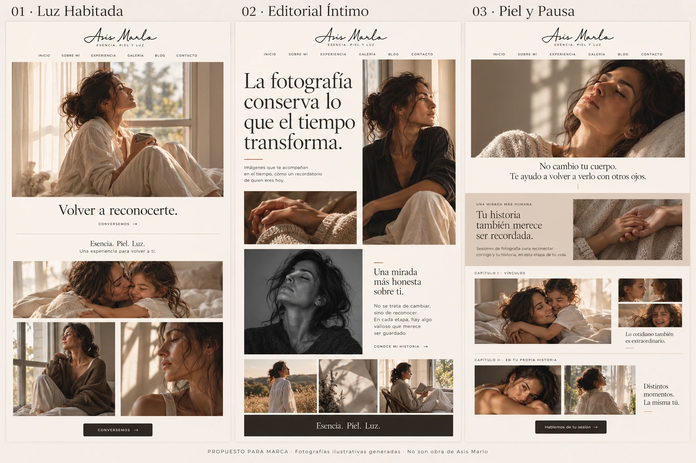

# Dirección de Arte Web — revisión fotográfica 02

**Estado: PROPUESTO — REVIEW REQUIRED.**  
Responsable: `director-arte-web-asis-marlo-01`.  
Consumidor: `revisor-marca-asis-marlo-01` / Dirección de Marca.  
Fecha: 2026-10-03 (America/Mexico_City).

## Comparativa para revisar

Esta lámina amplía las tres direcciones existentes a partir de la referencia `196048.png` que Javier compartió. No es una implementación, una selección de obra ni una aprobación de Marca.

Javier señaló que las primeras composiciones parecían iguales y autorizó expresamente utilizar imágenes ajenas al portafolio de Marlo para valorar las diferencias. Las fotografías de esta nueva lámina son **ilustrativas generadas**; no son fotografías de Asis Marlo, clientas reales ni material publicable del portafolio.

## Fuente y alcance

- Identidad visual base v1: `marca/identidad-visual-base-v1.md`, APROBADO MARCA.
- Logo de referencia íntegro: PNG `asis-marlo-logo-web(2).png` proporcionado en Fuentes del proyecto, conservado para trazabilidad en `../logo-referencia-fuentes.png`.
- Referencia visual de Javier: `196048.png`, usada para nivel de desarrollo, no como nueva identidad aprobada.
- Lámina generada con la herramienta integrada de imágenes; exportada a WebP de 1536 × 1024, calidad 92 / método 6, sin cambios de composición posteriores.
- El lettering que aparece en una imagen generada es una representación de maqueta: **no es un nuevo activo oficial ni garantía de fidelidad exacta del logo**. La implementación deberá insertar el archivo original aprobado.
- El copy adicional, los rótulos, las categorías y la navegación representados son exploratorios. No aprueban nuevas páginas, servicios ni frases de marca.
- No se generó código web, stack ni estructura implementable.

## Diferencias que debe juzgar Marca

| Dimensión | 01 · Luz Habitada | 02 · Editorial Íntimo | 03 · Piel y Pausa |
|---|---|---|---|
| Sensación | Luz, calma, contemplación | Mirada de autora y expresión editorial | Cercanía, confianza, historia humana |
| Hero | Una imagen amplia; frase debajo | Titular grande y retrato en columnas asimétricas | Retrato próximo; voz humana debajo |
| Fotografía | Toma ambiental y gesto completo | Contrapunto entre retrato, manos y blanco y negro | Secuencia de vínculo, gesto y contexto |
| Ritmo | Foto → aire → frase → foto | Escalas y densidades contrastantes | Capítulos con proximidad interna y pausas entre ellos |
| Portafolio | Imagen abierta y díptico | Secuencia editorial en retícula | Relatos agrupados por capítulos |
| Paleta | Marfil dominante; espresso discreto | Marfil dominante; una franja espresso breve | Marfil y apoyo arena en un capítulo |
| Jerarquía verbal | Serena | Expresiva y de mayor escala | Media y cercana |
| CTA | Contacto discreto | Acción separada de la obra | Contacto como cierre de conversación |
| Riesgo | Neutralidad intercambiable | Frialdad o tipografía demasiado dominante | Parecer wellness o reducir intimidad a boudoir |

La tercera propuesta no debe confundirse con un retoque corporal ni una promesa terapéutica. La segunda no debe recuperar la oscuridad predominante de la referencia de Javier. La primera necesita personalidad real en la selección fotográfica, no sólo un fondo claro.

## Reglas propuestas que permanecen

Las trece dimensiones completas están documentadas en `../propuesta-01/DIRECCION.md`, `../propuesta-02/DIRECCION.md` y `../propuesta-03/DIRECCION.md`: concepto, fotografía, retícula, tipografía, vacío, paleta, logo, navegación, CTA, movimiento, hero, galería y reconocimiento de Asis Marlo.

Esta revisión hace comparables sus aplicaciones visuales. No aprueba las familias candidatas ni convierte el texto generado en copy definitivo. Los esquemas anteriores contienen la intención desktop/móvil; esta lámina muestra sólo desktop y no valida responsive.

El movimiento sigue siendo breve y opcional, sin autoplay ni scroll intervenido. La galería debe preservar proporciones y orden narrativo, con controles explícitos. Arquitectura resolverá la realización técnica después de la aprobación de Marca.

## Observaciones sobre el resultado

- Las tres versiones ahora muestran fotografía y secuencias, sin reservas vacías.
- La base de interfaz es luminosa; la variante editorial contiene sólo una pausa oscura breve.
- Los principales CTA sólidos se presentan en oscuro, sin botones dorados.
- El texto principal se mantiene en zonas propias, sin tapar rostros o cuerpos.
- La representación de fuentes, colores y logo por generación no sustituye una especificación exacta: las reglas del repositorio prevalecen.
- La generación añadió una fotografía de flores/objeto en la versión editorial; es material exploratorio prescindible, no regla de decoración ni activo requerido. Marca puede pedir retirarla.
- Parte de la pose del hero de Piel y Pausa sigue evocando un retrato reclinado. Marca debe juzgar si sostiene intimidad y naturalidad o si requiere cambiarse por una toma de mayor presencia cotidiana.
- No se ha comprobado el conjunto con fotografías reales autorizadas de Marlo.

## Decisión solicitada

Dirección de Marca deberá indicar por propuesta: **APROBADO MARCA / AJUSTAR / RECHAZADO MARCA**, con criterio y alcance. Si combina direcciones, especificar el origen de hero, ritmo, portafolio, tipografía, uso de fondos y CTA.

Se puede revisar intención artística con esta lámina, pero la validación final de composición fotográfica requiere material real y el logo original insertado fielmente.

## Handoff

ORIGEN: director-arte-web-asis-marlo-01  
RESPONSABLE: director-arte-web-asis-marlo-01  
CONSUMIDOR: revisor-marca-asis-marlo-01  
HEAD / ESTADO BASE: 1e6d19f4f7fa3838e312f63b45d5f85c029de256; PR #1  
TAREA: desarrollar comparativa fotográfica diferenciada y entregarla en el repositorio para Marca  
AUTORIDAD APLICABLE: AGENTS.md, contratos, identidad visual v1 e instrucción explícita de Javier para imágenes ilustrativas  
HECHO: nueva lámina con tres recorridos; contraste de direcciones; revisión de desviaciones; procedencia y límites registrados  
NO HECHO: aprobación, selección de fotografía real, copy final, fuentes definitivas, implementación, integración a main o publicación  
ARTEFACTOS: revision-02/comparativa-fotografica.webp y revision-02/REVISION-MARCA.md  
VALIDACIÓN: inspección visual de lámina; WebP abre correctamente a 1536 × 1024; se verificará presencia en la rama tras escritura  
RIESGOS: representación generada de logo/texto/paleta; fotografías ilustrativas; responsive no validado  
DEPENDENCIAS: decisión de Marca; material real autorizado; normalización del logo canónico por su responsable técnico  
DECISIÓN REQUERIDA DE: revisor-marca-asis-marlo-01  
SIGUIENTE ACCIÓN: Marca devuelve decisión documentada; Dirección de Arte ajusta y, tras aprobación oficial, prepara handoff para Arquitectura  
ESTADO: REVIEW REQUIRED

## Prompt de generación registrado

Comparativa plana de tres mockups fotográficos de home, usando `196048.png` como referencia de completitud y el PNG original como referencia de marca. Marfil predominante, espresso para texto/CTA, arena de apoyo, nude restringido. Mujeres adultas vestidas, piel natural y vínculo familiar; sin glamour artificial, lencería, sexualización, rosa dominante o dorado. Luz Habitada como exposición calmada; Editorial Íntimo como publicación asimétrica con titular de gran escala y una única franja oscura breve; Piel y Pausa como álbum narrativo por capítulos. Logo negro en header claro, frases del contrato de Marca, texto separado de cuerpos y rostros. Pie visible: “PROPUESTO PARA MARCA · Fotografías ilustrativas generadas · No son obra de Asis Marlo”.
